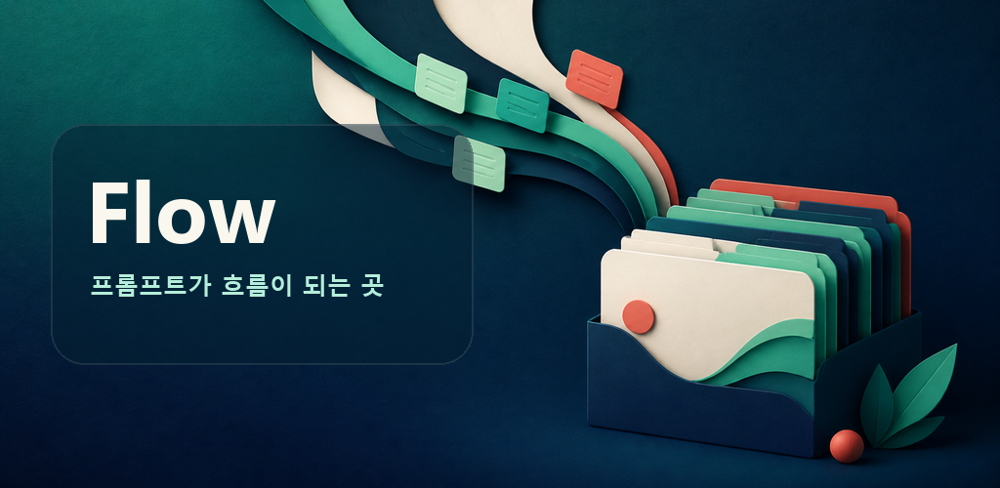
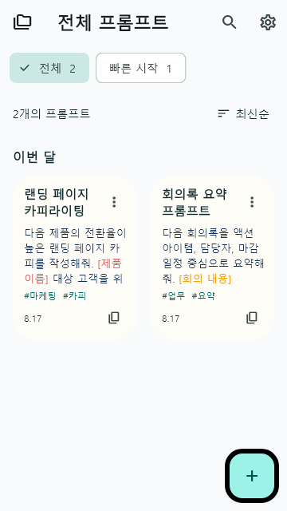
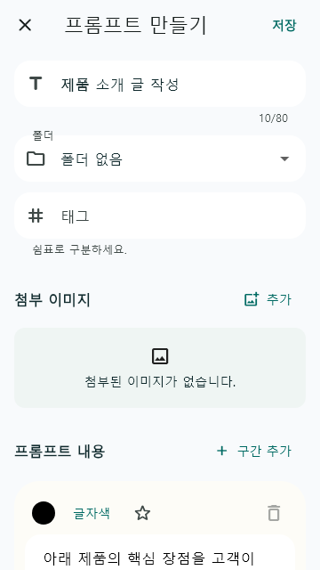
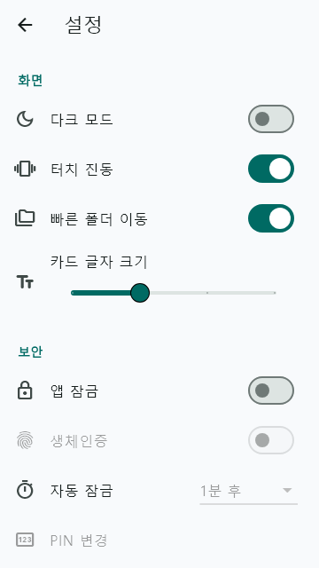
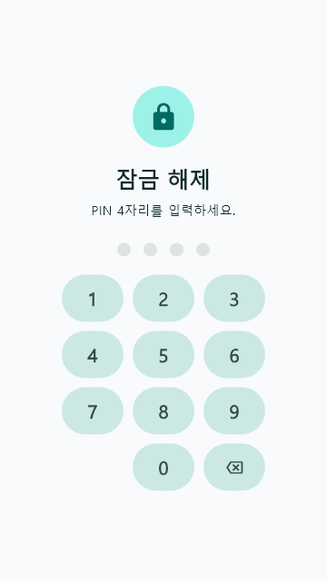

# Flow

<p align="center">
  
</p>

<p align="center">
  자주 사용하는 AI 프롬프트를 저장하고, 정리하고, 바로 꺼내 쓰는 모바일 앱
</p>

<p align="center">
  <a href="https://github.com/gitzzang11/flow-mobile/releases/latest">
    
  </a>
  <a href="https://github.com/gitzzang11/flow-mobile/releases/download/v1.0.0/app-release.apk">
    
  </a>
  
</p>

## 소개

Flow는 자주 사용하는 AI 프롬프트를 폴더와 태그로 정리하고, 검색·복사·공유를 빠르게 할 수 있도록 만든 Android/iOS용 Flutter 앱입니다. 별도 계정이나 서버 없이 기기 안에서 프롬프트를 관리할 수 있습니다.

## 주요 기능

| 영역 | 기능 |
| --- | --- |
| 프롬프트 | 생성, 편집, 복제, 고정, 검색, 정렬, 구간별 색상 편집 |
| 정리 | 폴더와 태그 생성·수정·삭제, 폴더 드래그 재정렬 |
| 첨부 이미지 | 갤러리·카메라 이미지 첨부, 썸네일·확대 보기 |
| 공유 | 클립보드 복사, Android/iOS 기본 공유 시트 |
| 보안 | PIN·생체인증 잠금, 백그라운드 복귀 시 자동 잠금 |
| 백업 | 첨부 이미지를 포함한 JSON 백업·복원, 가져오기 검증 |
| 사용자화 | 다크 모드, 터치 진동, 카드 글자 크기, 작은 화면·접근성 대응 |

## 미리보기

<table>
  <tr>
    <td align="center"><strong>홈</strong></td>
    <td align="center"><strong>프롬프트 편집</strong></td>
    <td align="center"><strong>설정</strong></td>
    <td align="center"><strong>잠금</strong></td>
  </tr>
  <tr>
    <td></td>
    <td></td>
    <td></td>
    <td></td>
  </tr>
</table>

## 다운로드

### Android

[](https://github.com/gitzzang11/flow-mobile/releases/download/v1.0.0/app-release.apk)

- 버전: `1.0.0` (`versionCode 1`)
- APK: [`app-release.apk`](https://github.com/gitzzang11/flow-mobile/releases/tag/v1.0.0)
- SHA-256: `EF63E94CB330C53B48F5386D2983B941A22A095CC5A5FD1CF7791B6561800F0B`

APK를 Android 기기에 내려받은 뒤 파일을 열어 설치할 수 있습니다. 기기 설정에 따라 출처를 알 수 없는 앱 설치 권한이 필요할 수 있습니다.

### iOS

iOS 소스가 포함되어 있습니다. iOS 시뮬레이터·실기기 실행과 배포용 아카이브 생성에는 macOS와 Xcode가 필요합니다.

## 보안 및 데이터

- 로그인이나 서버 계정 없이 기기 내 로컬 데이터 중심으로 동작합니다.
- PIN은 보안 저장소(Keychain/Keystore)를 활용해 관리하며, 생체인증 잠금을 지원합니다.
- JSON 백업에는 프롬프트와 첨부 이미지가 포함되지만 PIN 및 PIN 해시는 포함되지 않습니다.
- 공개 개인정보처리방침: [flow-privacy-policy.ppppjjwww.chatgpt.site](https://flow-privacy-policy.ppppjjwww.chatgpt.site)

## 개발 환경

- Flutter SDK
- Dart SDK `^3.11.4`
- Android SDK / API 36
- Android 최소 SDK 24
- iOS 개발 시 macOS 및 Xcode

## 시작하기

```bash
flutter pub get
flutter run
```

특정 플랫폼을 지정하려면 다음과 같이 실행합니다.

```bash
flutter run -d android
flutter run -d ios
```

## 검증 및 빌드

```bash
# 정적 분석
flutter analyze

# 테스트
flutter test

# Android 디버그 APK
flutter build apk --debug

# Android 배포 APK
flutter build apk --release

# Google Play 업로드용 App Bundle
flutter build appbundle --release
```

Android release 빌드는 로컬의 `android/key.properties`와 업로드 keystore가 필요합니다. 두 파일은 저장소에 포함하지 마세요.

## 프로젝트 구조

```text
lib/                         Flutter 앱 소스
test/                        단위·위젯 테스트
assets/                      앱 아이콘과 이미지 자산
docs/google-play/            Play Console 문서와 개인정보처리방침
android/                     Android 프로젝트
ios/                         iOS 프로젝트
```
